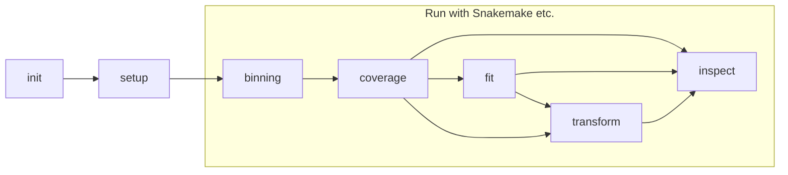
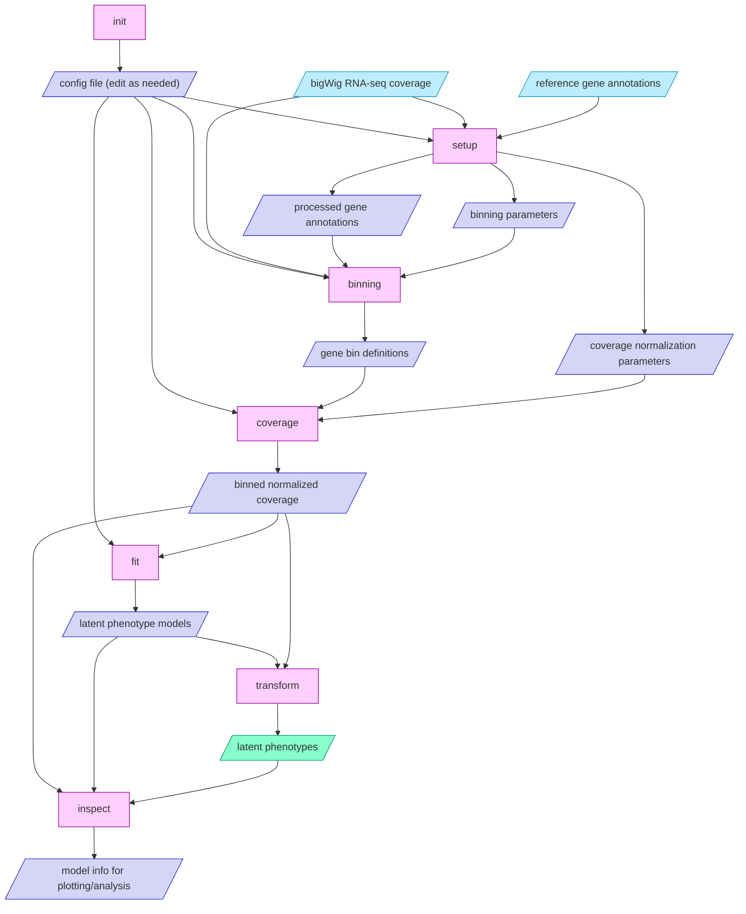
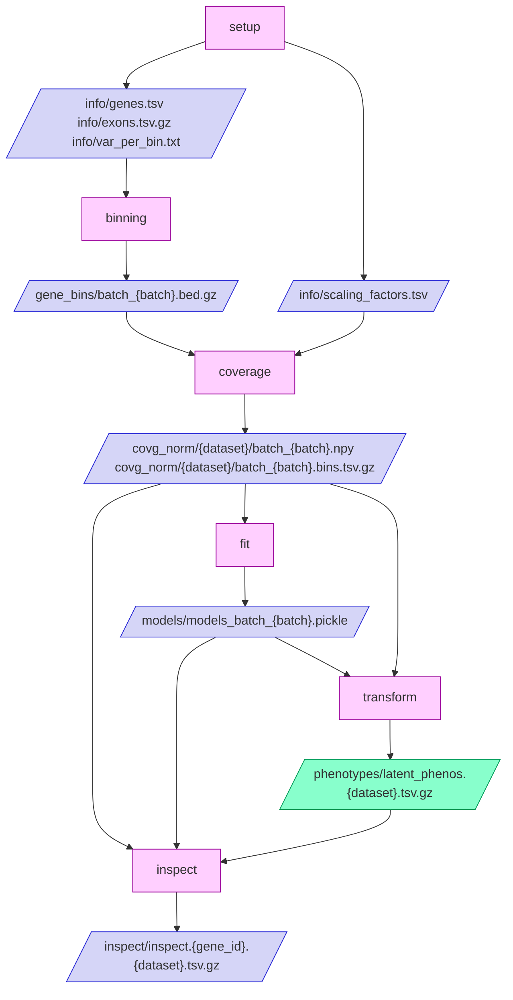

# latent-rna
 Extract latent transcriptomic phenotypes

## Installation

```shell
cd latent-rna
pip install -e .
```

## Setup

Run this command to generate a project directory `myproject` with the basic config and to template options for running the pipeline:

```shell
latent-rna init myproject
cd myproject
```

```
Project initialized at myproject

Files created:
  myproject/
    config.yaml: Edit this file to configure your project
    run.sh: Shell script for running the project
    Snakefile: Snakemake file for running the project
```

Either `run.sh` or `Snakefile` can be modified as needed to run the project. We recommend adapting the `Snakefile` for your project and using the [Snakemake](https://snakemake.readthedocs.io/en/stable/) workflow system.

Aside from command line arguments for the dataset and/or batch for which to run a command, all parameters, file paths, etc. are specified in the `config.yaml` file, since they are often reused across commands. The default config contains parameters for the recommended binning and model fitting methods. To start with a config file containing all method options and parameters, use `latent-rna init myproject --config-type extended`.

`examples/` contains two project directories set up to run example projects on two small datasets using either method. If you install the package from pip and do not have `examples/`, you can generate its two subdirectories with these commands:

```shell
latent-rna init shell --config-type example --template shell
latent-rna init snakemake --config-type example --template snakemake
```

### Get base-level RNA-seq coverage

This tool uses base-level RNA-seq coverage in bigWig format. For BAM files, first convert them to bigWig using [`bamCoverage`](https://deeptools.readthedocs.io/en/develop/content/tools/bamCoverage.html) from [`deeptools`](https://deeptools.readthedocs.io/en/develop/index.html):

```shell
bamCoverage -b /path/to/bams/sampleA.bam -o covg_bigwig/sampleA.bw -of bigwig --binSize 1 -p 4
```

Then, make a coverage manifest file listing the dataset, sample ID, and path to all bigWig files, e.g.:

```
tissue1	S000	../data_input/covg_bigwig/tissue1/S000.bw
tissue1	S001	../data_input/covg_bigwig/tissue1/S001.bw
...
tissue8	S098	../data_input/covg_bigwig/tissue8/S098.bw
tissue8	S099	../data_input/covg_bigwig/tissue8/S099.bw
```

A latent phenotype table will be produced for each dataset containing phenotypes for its samples. The reason multiple datasets are supported is that the coverage data can be loaded together and the latent phenotype models can be fit jointly, so that the models are trained on biologically diverse data and the phenotypes correspond across datasets.

## Usage

This method involves five main steps, plus a sixth optional analysis step, as outlined below.

### 1. Set up gene info etc.

This command prepares any data that needs to be generated once before the batch processing steps are run:

```shell
latent-rna setup
```

This must be run before running the Snakemake pipeline. It generates a table of gene information and a table of exon regions extracted from the gene annotation GTF file. It filters genes to include only those with `gene_biotype`/`gene_type` of  "protein_coding", and assigns genes to batches so that the binning, coverage processing, and model fitting steps can be run in batches for parallelization and to reduce memory.

For certain adaptive binning methods, including the default method, this step also computes a cumulative variance threshold used in each batch of the binning step to produce the desired number of bins.

It requires two reference files specified in your config file:

- Gene annotations in GTF format.
- Chromosome lengths, which can be `chrNameLength.txt` from the STAR index or the `*.fa.fai` genome FASTA index file.

Beware editing the config file after running `latent-rna setup`, as the info generated may not be compatible with the updated parameters and cause silent bugs.

### 2. Define genomic bins

Then, split gene regions into bins to be used for summarizing and representing coverage data:

```shell
latent-rna binning --batch 0
```

By default, binning is determined using coverage data, partitioning each gene in a way that aims to define more, smaller bins in areas of greater variation across samples. It excludes any bins that overlap the exon of another protein-coding gene.

### 3. Bin and normalize RNA-seq coverage

For each gene batch, use its bin definitions to get mean coverage per bin for all samples and normalize:

```shell
latent-rna coverage --dataset dset1 --batch 0
```

At this stage you can also provide quantified explicit phenotypes, e.g. from [Pantry](https://github.com/PejLab/Pantry), to regress out. Training and applying models on this residualized coverage data results in "residual" latent RNA phenotypes, which can complement the explicit phenotypes by representing uncharacterized transcriptomic variation.

### 4. Fit latent RNA phenotype models

Normalized coverage data are loaded, one batch at a time, and used to fit a PCA (or FPCA) model for each gene. If a project involves multiple datasets, e.g. tissues, the coverage count matrices for each dataset will be loaded together, and the models will be fit on the concatenated data.

```shell
latent-rna fit --batch 0
```

### 5. Generate latent RNA phenotypes

Normalized coverage matrices are loaded, one batch at a time, and transformed using the fitted models. The transformed data is saved as a table of phenotypes by samples, i.e. multiple PCs per gene. If a project involves multiple datasets, the coverage count matrices for each dataset can be loaded and transformed separately using the same set of models, so that the phenotypes correspond across datasets.

```shell
latent-rna transform --dataset dset1
```

### 6. (Optional) Analyze latent RNA phenotype models

This command inspects the latent RNA phenotype model for a specific gene, and uses raw coverage, stored models, and latent phenotypes:

```shell
latent-rna inspect -g ENSG00000008128 -d dset1
```

The output for a PCA model is a table with one row per bin:

```
gene_id	pos	mean	std	PC1	PC2	...	top_tenth_PC10	bottom_tenth_PC10
ENSG00000008128	-998	3.55851	0.308595	0.0338629	0.0656172	...	3	3.36499
ENSG00000008128	-987	3.42529	0.289488	0.0031310	0.067382	...	3.13462	3.36499
ENSG00000008128	-969	3.45428	0.237121	0.0074943	0.0712902	...	3.15166	3.44746
```

The first four columns give the gene ID, bin center position relative to the gene TSS, and mean and standard deviation of normalized coverage used for training. (Normalized coverage values are three or higher because coverage is log2-transformed after adding a pseudocount of eight.) The next columns give the PCA loadings for each saved PC (latent phenotype). Finally, for each latent phenotype, the top and bottom 10% of samples according to their values for that phenotype are identified, and the mean (log-scaled, normalized) coverage in those samples is given. These values can be plotted to visualize the coverage patterns along the gene that each latent phenotype represents.

### Workflow diagrams

This flowchart shows how the workflow steps fit together:



Here is a more detailed flowchart that includes the type of input and output data for each step:



This flowchart shows templates of the names of files produced by each step under the default project structure:


